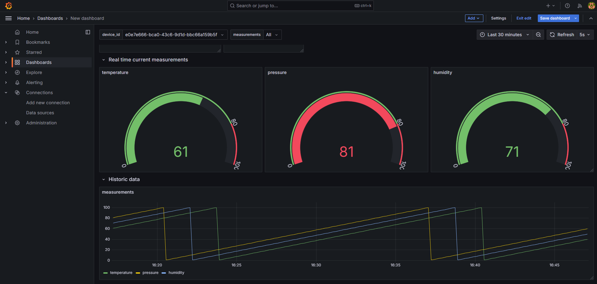
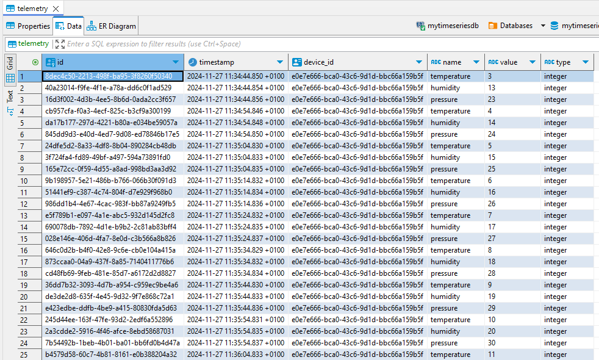

# The Boring Project Documentation

## Overview

This application is designed to ingest and visualize measurements from IoT devices.

## Architecture

The application follows a microservice architecture. Below is a high-level overview of the system architecture:


## Features

- use a dev container for development
- use a docker-compose file to run the application
- use a .env file to store environment variables

The application provides the following features:

- **Feature 1**: simulator to generate synthetic mqtt messages for testing purposes.
- **Feature 2**: async ingestion of mqtt messages into a time series database.
- **Feature 3**: using mqtt wildcards to subscribe to multiple topics.
- **Feature 4**: dashboard to visualize the ingested measurements.

## Screenshots

### Dashboard

The dashboard provides an overview of ingested measurements.



### Database Schema

The database schema lets you ingest any measurement with any datatype you want.



## Installation
To install and run this application, follow these steps:

1. Build and start the application using Docker Compose:
    ```sh
    docker-compose up --build
    ```

## Usage

To use the application, navigate to the following URLs:
http://localhost:3000/login - Grafana login page

default credentials:
- username: admin
- password: admin

## Contact

If you have any questions or suggestions, feel free to contact.
